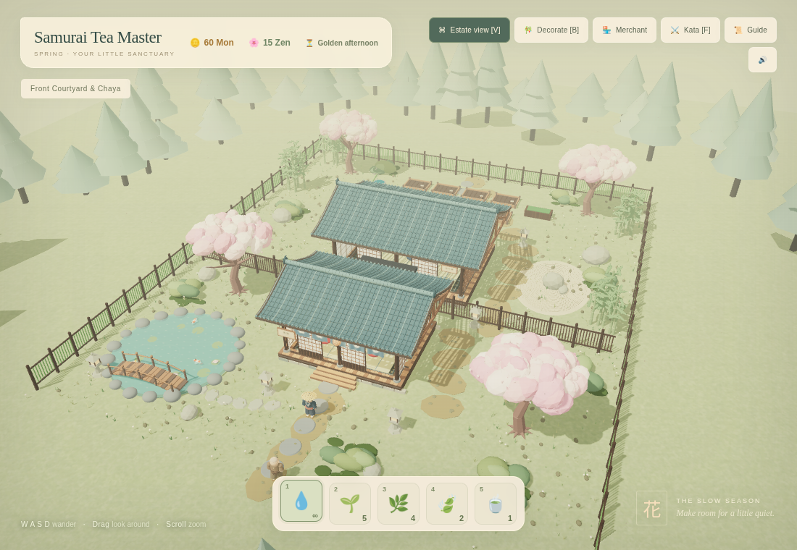

# Samurai Tea Master

A cozy, playable 3D tea estate: grow heirloom tea, welcome travelers, brew a bowl of matcha, and arrange a quiet Japanese garden.

The estate includes modeled kimono folds and character faces, curved ceramic roof tiles, timber joinery, woven curtains, open ceramic tea bowls, cherry-blossom canopies, mossy stones, bamboo groves, an arched bridge, swimming koi, water lilies, drifting petals, and kettle steam. Warm lighting changes gradually through the day. Roofs lift away when you enter a room, and the camera rises to keep the backyard visible.



## Play locally

**No installation needed:** download `samurai.html` and open it in a desktop browser. This standalone file includes Three.js and works offline. Use a browser with WebGL and hardware acceleration enabled.

Or serve the repository with Python:

```sh
git clone https://github.com/lazzyisbored/samurai.git
cd samurai
python3 -m http.server 8000
```

Open `http://localhost:8000` in your browser. `index.html` uses the bundled `vendor/three.min.js`; neither version contacts a CDN.

## Controls

| Control | Action |
| --- | --- |
| W A S D / arrow keys | Walk |
| Drag / scroll | Orbit / zoom |
| E / Space | Plant, water, harvest, brew, or serve |
| 1–5 | Select a hotbar item |
| B | Decorate the garden |
| R / X | Rotate / store a decoration |
| F | Practice a peaceful katana kata |
| V | View the whole estate |

Select seeds with **2** or **3**, plant in an empty plot with **E**, then select the watering can with **1** and water with **E**. Harvest when the plant is ripe. Brew at the tea-house hearth and serve nearby guests. The Merchant sells seeds and seven detailed garden decorations.

## Development

Edit `index.html`, then regenerate the standalone version:

```sh
python3 scripts/build_standalone.py
```

Models, textures, and ambient effects are generated in the game; no asset downloads or build dependencies are required. Repeated foliage uses instancing, and static model details are merged by material. The bundled Three.js r128 distribution retains its MIT license in `vendor/THREE-LICENSE.txt`.

This prototype uses mouse and keyboard controls; progress currently lasts for the open browser session.
